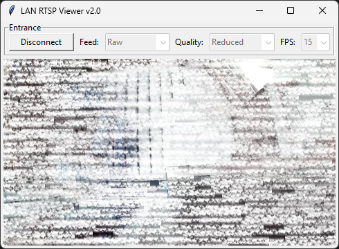

# LAN-RTSP-Viewer

**LAN-RTSP-Viewer** is written in Python and uses the OpenCV library to capture video feed.

---

### LAN-RTSP-Viewer UI

---

## Features

- View LAN RTSP streams
- View feed in different filter modes
  - Raw + motion rects
  - Motion detection
  - Edge detection

---

## Add streams

To add streams, configure the [`streams.json`](streams.json) file.
